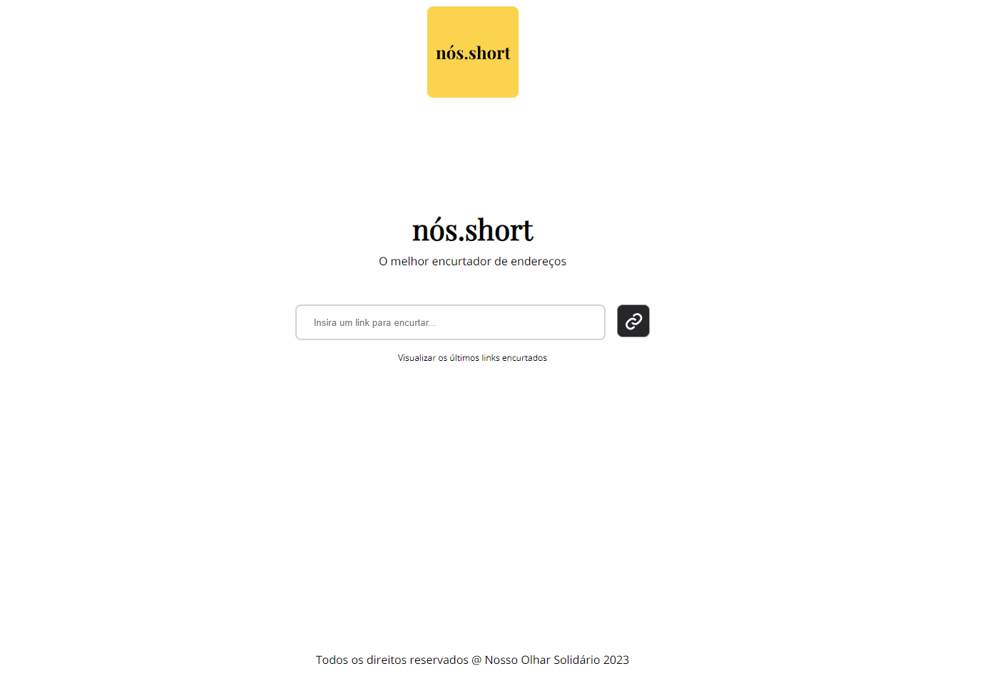
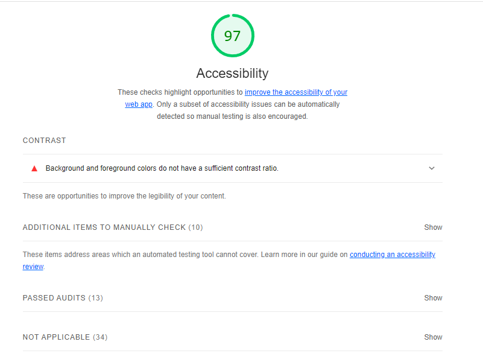
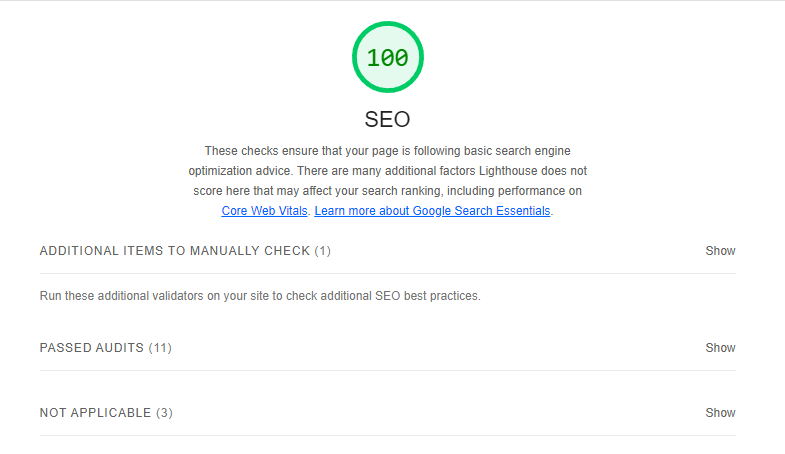
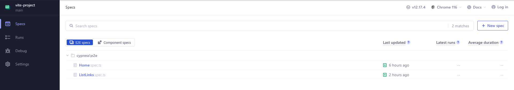

# nós.short React + TypeScript + Vite

## O que é isso?

Uma aplicação de desafio para o processo seletivo do NOS - Nosso Olhar Solidário utilizando React + TypeScript + Vite.

## Demonstração

Acesse: https://nos-short.vercel.app/

<a href="https://nos-short.vercel.app/" rel="some text">



</a>

## Como usar

- Instale as depencias utilizado `npm install` ou `yarn install`

- Execute o comando `npm run dev` ou `yarn dev`

- Acesse: <a href="http://localhost:5173" rel="some text">http://localhost:5173</a>

## Desafios Resolvidos:

O funcionamento dos desafio podem ser verificados via testes e2e com cypress. A seguir os desafios que foram resolvidos.

[x] Desafio 1

- Adicione a biblioteca “react-toastify” para adicionar mais uma forma de dar feedback para o usuário quando o link encurtado for copiado na área de transferência

[x] Desafio 2

- Adicione um botão para que seja possível de remover links encurtados do histórico. Nota: Lembre-se de usar a API para remove-lo também

[x] Desafio 3

- Adicionar suporte para telas menores, como celulares e tablets

- Nota: Utilize propriedades vindas do próprio CSS, como media query

[x] Desafio 5

- Adicione a biblioteca "react-toastify" para adicionar uma forma de dar feedback ao usuário, caso tenha ocorrido algum problema durante a requisição do encurtamento do link provido pelo usuário

[x] Desafio 6

Adicione uma forma de mostrar em horas/minutos a quantidade de
segundos restantes para um link expirar

[x] Desafio 7

- Construa toda a aplicação seguindo as normas da WCAG para
  que seja mais acessível

  

[x] Desafio 8

- Melhore o seu índice SEO (Search engine optimization) utilizando as tags
  semânticas do HTML, e testando o website utilizando a ferramenta Lighthouse



### Obs:

- As análises a cima foram feitas em produção via vercel.

## Testes e2e

A fim de garantir cobertura de testes foi desenvolvido testes e2e com cypress.

- Rode o cypress em modo dev: `yarn run cy:e2e` ou `npm run cy:e2e`

Você terá a saida a seguir:



Só escolher um teste e clicar em cima.

- Rode o cypress em modo CI/CD: `yarn cy:e2e-ci` ou `npm run cy:e2e-ci`

Após a execução dos testes você vera a seguinte saida no terminal:

```
====================================================================================================

  (Run Finished)


       Spec                                              Tests  Passing  Failing  Pending  Skipped
  ┌────────────────────────────────────────────────────────────────────────────────────────────────┐
  │ ✔  Home.spec.ts                             00:12        4        4        -        -        - │
  ├────────────────────────────────────────────────────────────────────────────────────────────────┤
  │ ✔  ListLinks.spec.ts                        00:15        3        3        -        -        - │
  └────────────────────────────────────────────────────────────────────────────────────────────────┘
    ✔  All specs passed!                        00:27        7        7        -        -        -

Done in 43.36s.

```

# Created by

```
  _                       _         _ _           _    _
 | |                     | |       | (_)         | |  (_)
 | |_   _  ___ __ _ ___  | | ____ _| |_ _ __  ___| | ___
 | | | | |/ __/ _` / __| | |/ / _` | | | '_ \/ __| |/ / |
 | | |_| | (_| (_| \__ \ |   < (_| | | | | | \__ \   <| |
 |_|\__,_|\___\__,_|___/ |_|\_\__,_|_|_|_| |_|___/_|\_\_|

```
