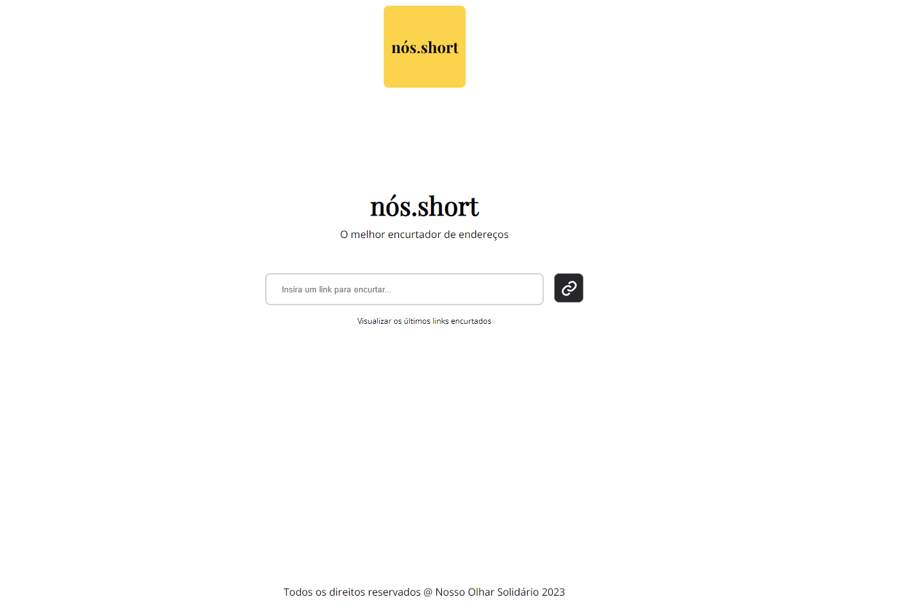

# nós.short React + TypeScript + Vite

<!-- TODO -->

[x] INPUT FOCUSED BORDER REMOVE
[x] VERCEL
[] JEST TEST INTEGRATION
[] circle ci
[x] GIT
[] COMP SPINNER
[x] destroy link
[x] listar link
[x] ver responsividade
[] arrumar readme

<!-- ## CI/CD -->

<!-- <p>
  <a href="https://circleci.com/gh/kalinskilk/workflows/ng-planning-poker/tree/main">
    
  </a>&nbsp;
</p>
 -->

# O que é isso?

Uma aplicação de desafio para o processo seletivo do NOS - Nosso Olhar Solidario utilizando React + TypeScript + Vite.

# Demonstração

Acesse: https://nos-short.vercel.app/

<a href="https://nos-short.vercel.app/" rel="some text">



</a>

# Como usar

- Instale as depencias utilizado `npm install` ou `yarn install`

- Execute o comando `npm run dev` ou `yarn dev`

- Acesse: <a href="http://localhost:5173" rel="some text">http://localhost:5173</a>

# Como funciona?

- Para construir utilize `npm run build` ou `yarn build`

# Created by

```
  _                       _         _ _           _    _
 | |                     | |       | (_)         | |  (_)
 | |_   _  ___ __ _ ___  | | ____ _| |_ _ __  ___| | ___
 | | | | |/ __/ _` / __| | |/ / _` | | | '_ \/ __| |/ / |
 | | |_| | (_| (_| \__ \ |   < (_| | | | | | \__ \   <| |
 |_|\__,_|\___\__,_|___/ |_|\_\__,_|_|_|_| |_|___/_|\_\_|

```
